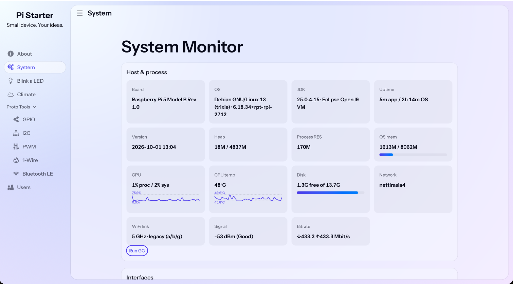
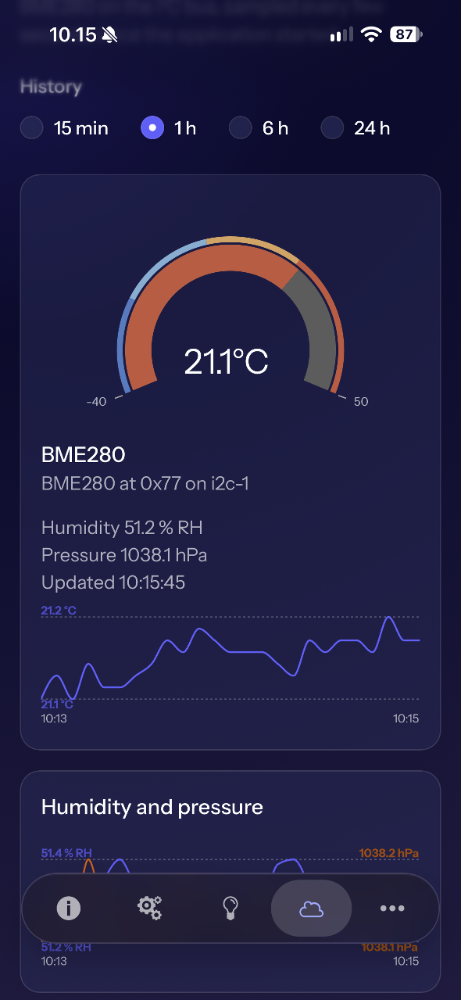

# Pi Java PWA Starter

A small Quarkus + Vaadin IoT application, split into independently buildable
Maven projects:

- **pi-starter**: runnable PWA, theme, navigation, browserless view tests and a browser smoke test.
- **pi-helpers**: reusable prototyping panels: System (host diagnostics, interfaces,
  power), GPIO, I²C, PWM/servo, 1-Wire and Bluetooth LE, plus the shared Pi4J context.
- **pi-helpers-simulation**: in-memory hardware for the pi-helpers services, for
  development and tests, and the browserless tests of the Proto Tools panels.

<p align="center">
  
  
</p>

▶ [Watch it on an iPhone](https://youtube.com/shorts/877Wl0i_BTY) (1:18): passkey
sign-in, adding the app to the home screen and a Web Push temperature alert from the
`example/web-push-notifications` branch.

Requires JDK 25. Build both modules, run the browserless view tests and the Playwright smoke test:

```sh
./mvnw verify
```

Start the example directly from its own directory with simulated BME280 data
and the other hardware helpers in simulation mode:

```sh
cd pi-starter
./mvnw -Psimulation quarkus:dev
```

The `simulation` Maven profile adds `pi-helpers-simulation` (GPIO, I²C, PWM,
1-Wire and BLE) and the example's own simulations in
`pi-starter/src/simulation/java` (the LED and the BME280). Both are CDI
alternatives for the device-facing services, so the regular sampling, history and
view code still runs, and both implement pi-helpers' `Simulated` marker, which
makes the views say that their data is made up. Tests use the same alternatives.
The profile uses its own build output directory and disables host power actions;
the production jar contains no simulation code.

The root POM only aggregates the projects. Build everything with
`./mvnw verify`, or install just the reusable library with
`./mvnw -pl pi-helpers install`. The example has its own POM and wrapper and
resolves `pi-helpers` as a normal versioned dependency, so it can be opened and
run on its own after that library version is available locally or from Maven
Central.

Two integration examples live on branches of their own, to keep `main` lean:

- **`example/web-push-notifications`**: min/max temperature alerts from the Climate
  view to a phone or desktop with Web Push.
- **`example/home-assistant-integration-via-mqtt`**: the Climate readings published
  to Home Assistant over MQTT discovery.

See [the example README](pi-starter/README.md) for application details and
[Pi Helpers](pi-helpers/README.md) for the reusable component.
